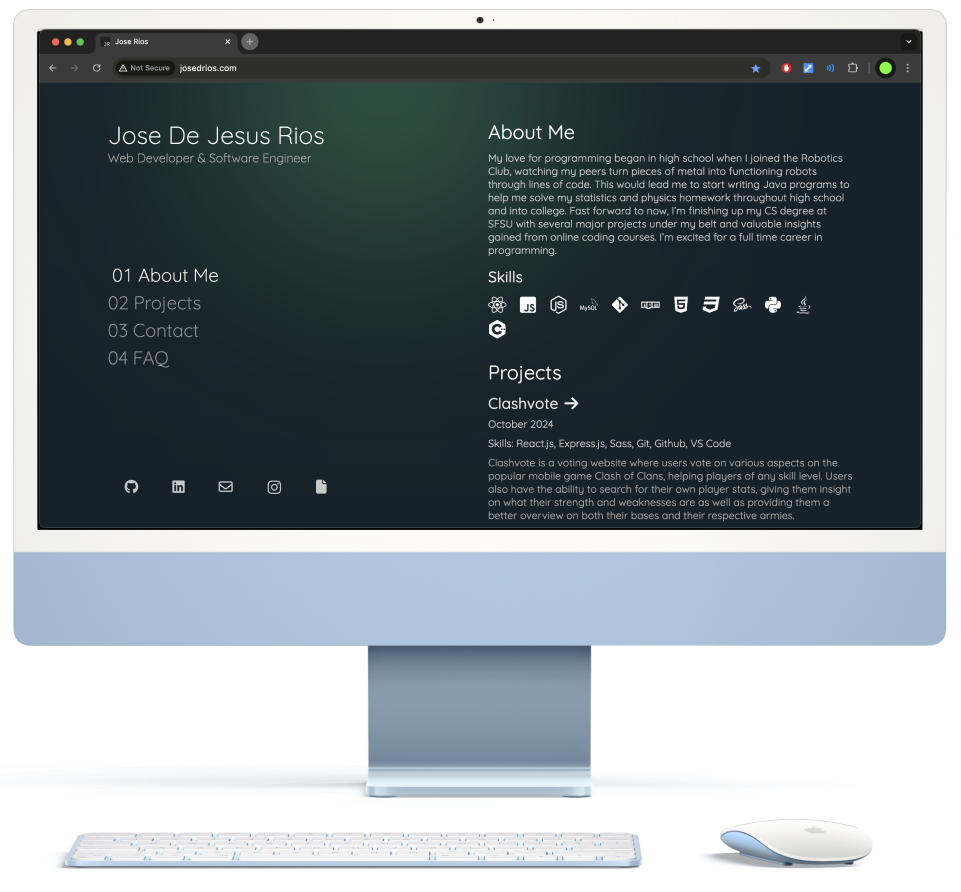

<h2 align="center">
  Portfolio Website <br/>
  <a href="http://josedrios.com">josedrios.com</a>
</h2>
<div align="center">
    
</div>

## Overview
This is the source code for my personal website that can be found at <a href="http://josedrios.com">www.josedrios.com</a>, where I showcase my skills, projects and experience as a web developer and software engineer. The website includes sections for my bio, skills, projects, contact information, social media links as well as FAQ's.

## Features
- Responsive design for all screen types and sizes
- Interactive and pleasing UI made with React.js and Sass
- Links to social media and resume

## Installation
1. Clone the repository:
   ```sh
   git clone https://github.com/josedrios/portfolio-website.git
   ```
2. Navigate into the project folder:
   ```sh
   cd portfolio-website
   ```
3. Install dependencies:
   ```sh
   npm install
   ```
4. Run the development server:
   ```sh
   npm run dev
   ```
5. Open `http://localhost:5173` in your browser.

## Contact
Feel free to reach out via:
- Email: josederios@outlook.com
- GitHub: <a href="https://github.com/josedrios" target="_blank" rel="noopener noreferrer">josedrios</a>
- LinkedIn: <a href="https://www.linkedin.com/in/jose-rios-3b9505254/" target="_blank" rel="noopener noreferrer">Jose Rios</a>

## License
This project is licensed under the MIT License.

